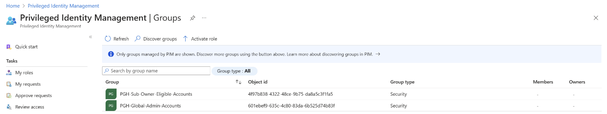
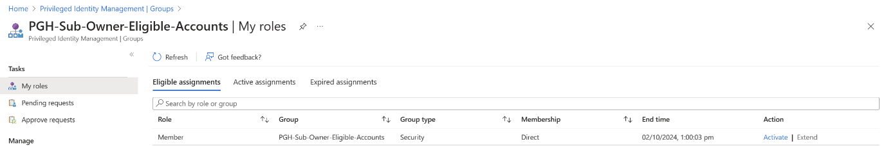
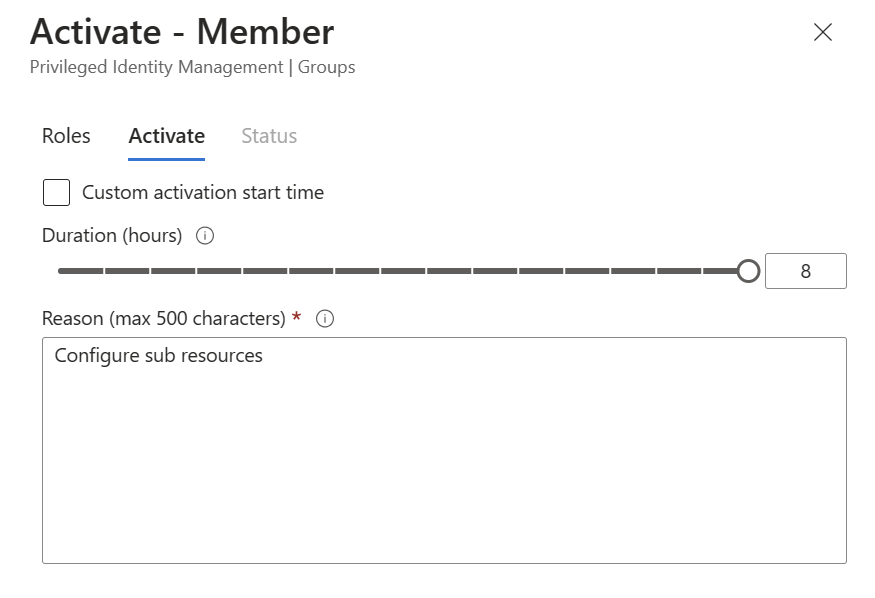
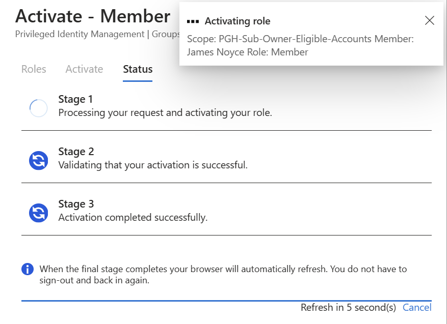

# PIM Group Activation

# Pre-requisites
Ensure that your MS Account is currently Active in the hack tenant. 

# Entra ID PIM Group Activation 

## To activate PIM Groups perform the following steps:
1. From a browser open 
    https://entra.microsoft.com/?feature.msaljs=true#view/Microsoft_Azure_PIMCommon/CommonMenuBlade/~/aadgroup  

2. Select the Group that you would like to activate

    
- Select PGH-Sub-Owner-Eligible-Accounts from the list
     
  
- Select Activate - far right on portal 
    

3. Enter a description of what you will be doing 

4. Click Activate button to begin the activation process

5. Wait for the process to complete 

6. Perform admin tasks on the Subscriptions